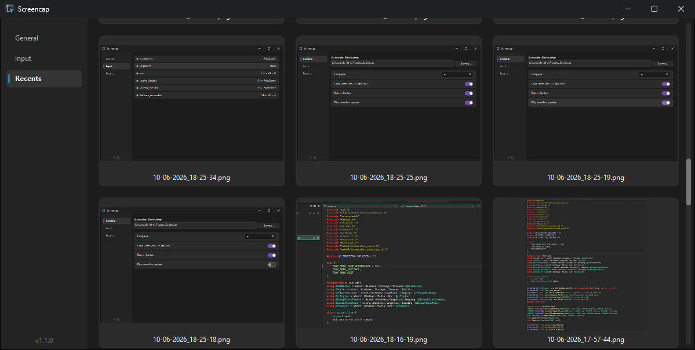

## Screencap
A simple standalone executable used for screenshotting  
Features:
- Interactive Screenshotting - Selecting window or region
- Screenshot active window
- Screenshot active desktop
- OCR support with some basic text detection
- Recent Gallery
- Magnifier for Interactive Mode
- Screenshot Sounds - made by [synthesthea](https://art.synthesthea.com/)
- Ability to change hotkeys  

I was going to get this working on MacOS, but I don't see the point as there's already some really nice ones there (CleanShot X for example), so there's some cleanup to do to simplify it as it only supports Windows now. However, I may support Linux in the future.

## Usage
To open the settings menu, go into your system tray and there you will find Screencap, click on that and press Settings  
In here, you can find the recents gallery along with the options. I'll likely add a separate option for Gallery/Recents in the tray menu.

As for the `fallback_screenshot` shortcut, that's a fallback for `screenshot` as printscrn on its own doesn't work in all applications.

## Screenshots
### Interactive Mode

### General

### Input

### Recents

[Credits](credits.md)