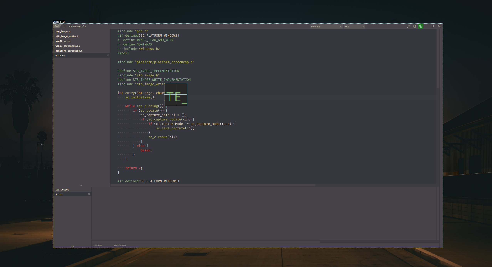
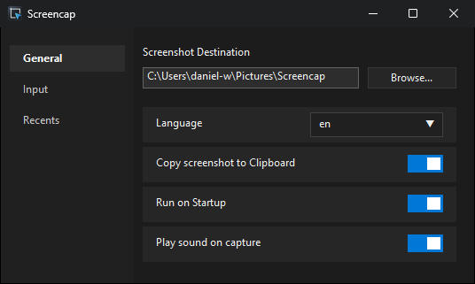
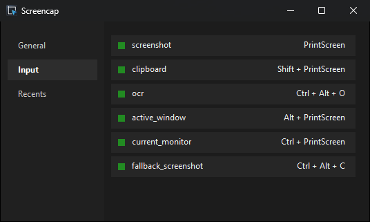
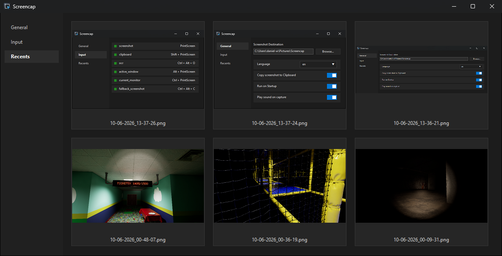

## Screencap
A simple standalone executable used for screenshotting  
Features:
- Interactive Screenshotting - Selecting window or region
- Screenshot active window
- Screenshot active desktop
- OCR support with some basic text detection
- Recent Gallery
- Magnifier for Interactive Mode
- Screenshot Sounds - made by [Thea](https://art.synthesthea.com/)
- Ability to change hotkeys

## Screenshots
### Interactive Mode

### General

### Input

### Gallery

[Credits](credits.md)