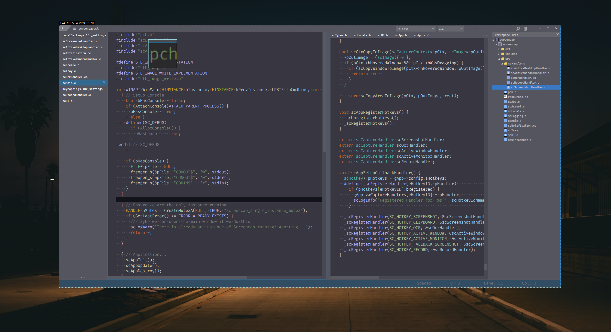
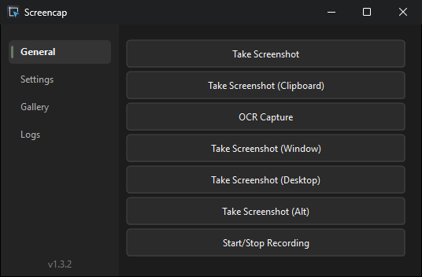
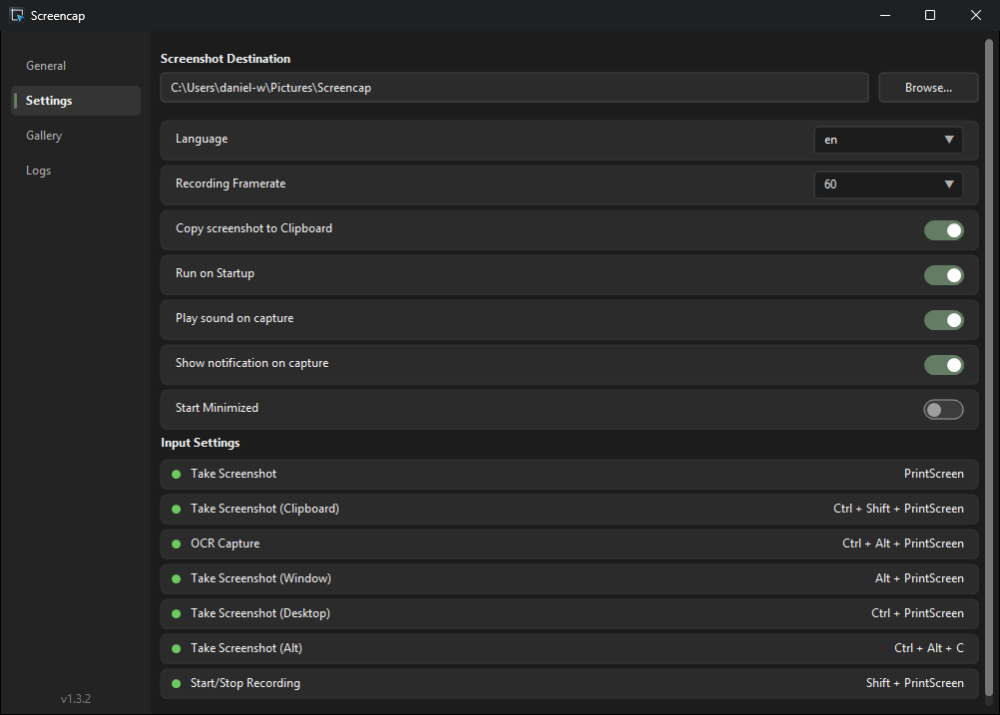
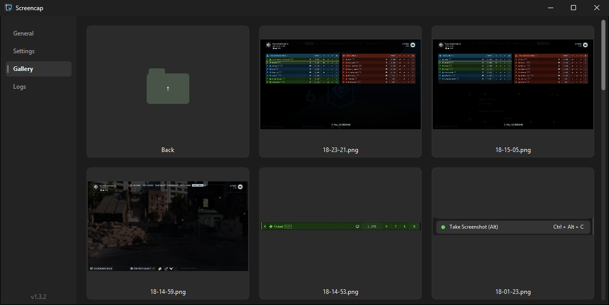
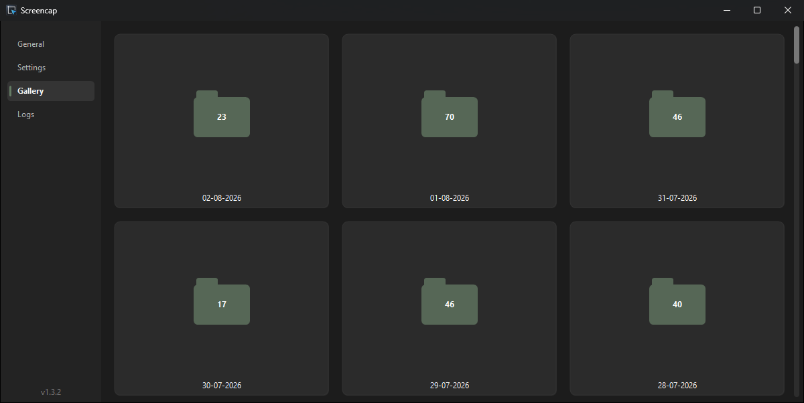
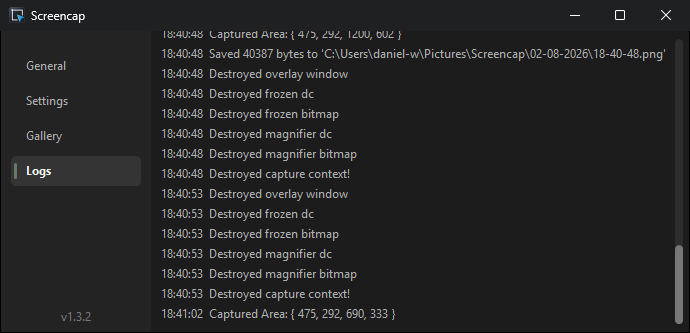
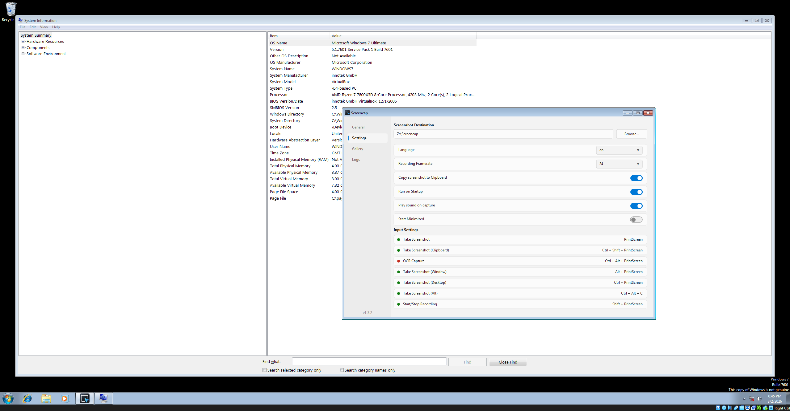

## Screencap
A simple standalone executable used for screenshotting  
Features:
- Windows 7 Support (Read Below)
- Fast and Native UI using GDI
- Theming that matches the current system settings
- Interactive Screenshotting - Selecting window or region
- Screenshot active window
- Screenshot active desktop
- Recording support (no audio and ffmpeg must be somewhere in the path of next to screencap)
- OCR support with some basic text detection
- Recent Gallery
- Magnifier for Interactive Mode
- Screenshot Sounds - made by [synthesthea](https://art.synthesthea.com/)
- Ability to change hotkeys  

## Usage
To open the settings menu, go into your system tray and there you will find Screencap, click on that and press Settings  
In here, you can find the recents gallery along with the options. I'll likely add a separate option for Gallery/Recents in the tray menu.

As for the `fallback_screenshot` shortcut, that's a fallback for `screenshot` as printscrn on its own doesn't work in all applications.

## Windows 7
In order for this to work on Windows 7 (I tested with Ultimate SP1), you need to download the following [redist](https://download.visualstudio.microsoft.com/download/pr/34922e31-a9d4-49cf-a245-9211b353c894/1AD7988C17663CC742B01BEF1A6DF2ED1741173009579AD50A94434E54F56073/VC_redist.x64.exe)

OCR will not work on Windows 7, however, everything else will function just fine.

## Screenshots
### Interactive Mode

### General

### Settings

### Gallery

### Logs

### Windows 7

[Credits](credits.md)